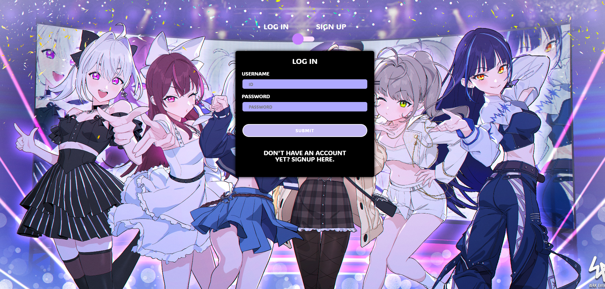
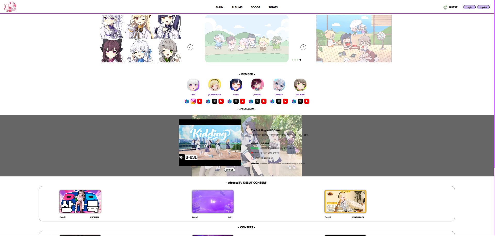
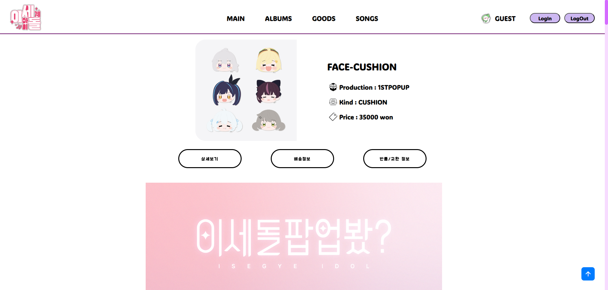
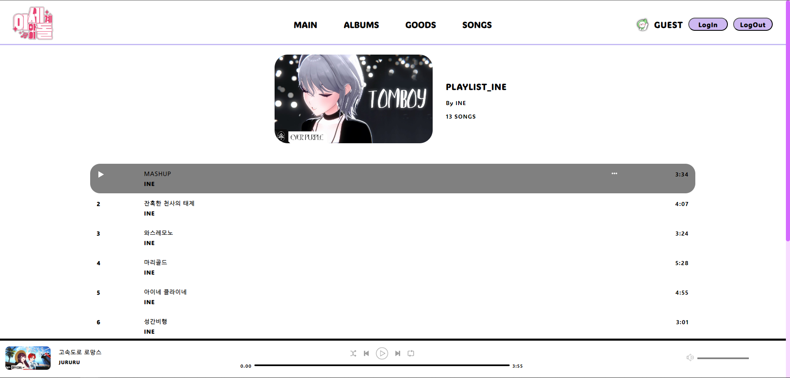
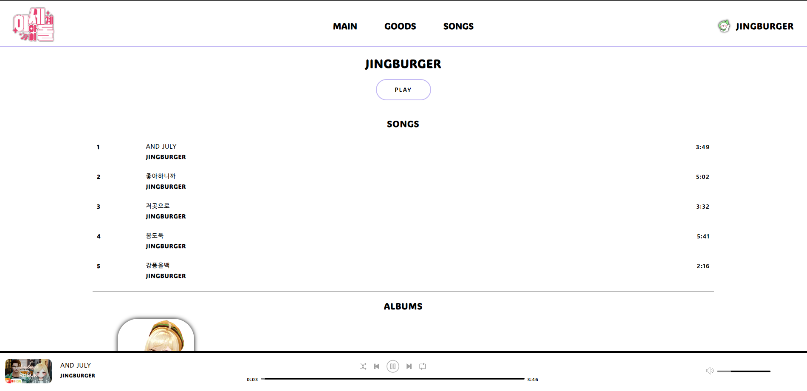
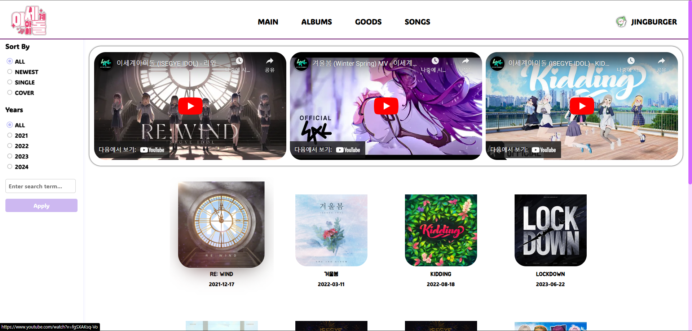

# **ISEGYE IDOL FanSite**
<!--프로젝트 메인 이미지-->


<hr>

<!--목차-->
## **목차**
- [**Project**](#project)
    - [Page Information](#page-information)
    - [Features](#features)
    - [Techniques](#techniques)
- [**Page**](#page)
    - [Regist Page](#regist-page)
    - [Main Page](#main-page)
    - [Goods Page](#goods-page)
    - [Goods Detail Page](#goods-detail-page)
    - [Song Page](#song-page)
    - [Song Artist Page](#song-artist-page)
    - [Album Page](#album-page)
- [**Caution**](#caution)
- [**Patch Notes**](#patch-notes)
- [**Contact**](#contact)

<hr>

<!--프로젝트 설명-->
## 📁**Project**
- 해당 프로젝트는 인터넷 방송인 그룹 **ISEGYE IDOL**의 정보 및 굿즈, MusicPlay를 목적으로 하였습니다.
- 공부한 php와 DataBase를 이용하여 진행한 프로젝트를 결합시켜 Fansite를 완성시켰습니다.

### 💡**Page Information**
- **Register Page**에서 Login 및 Sign up을 통해 Main Page로 진입이 가능합니다.
- **Main Page**에서는 멤버의 단체 팬아트, SNS, 최신 앨범, 데뷔 및 콘서트 방송에 대해 알 수 있습니다.
- **Goods Page**의 경우 최신 단체곡 및 굿즈의 정보를 정렬 및 확인할 수 있습니다.
- **Goods Detail Page**의 경우 제품의 상세정보, 배송, 반품 / 교환에 대해 알 수 있습니다.
- **Song Page**의 경우 각 멤버 별 DB에 등록된 노래 및 하단 PlayBar를 통해 Music Play가 가능합니다.
- **Song Artist Page**의 경우 해당 맴버의 Playlist 실행, id값을 통한 노래 5가지, Album Art를 확인할 수 있습니다.
- **Album Page**의 경우 Sidebar의 정렬 기능 및 검색기능, 상단의 싱글앨범 1집부터 3집 영상, Single곡과 Cover곡을 확인할 수 있습니다.

### **Features**
- 기본적인 사이트의 구조에 대해 정리하였습니다.
- PHP를 이용한 SESSION의 사용 및 DB를 이용하기 위한 SQL정보 및 Data 구조를 확인할 수 있습니다.
-> SQL의 경우 DB/sql.txt를 통해 확인할 수 있습니다.
- PHP를 이용한 변동되지 않는 부분의 고정 및 MainCotent 수정 방법을 확인할 수 있습니다.
- 스크롤 바의 경우 간단하게 색 변경 및 테두리 수정을 하였습니다.
```
/* 스크롤바의 폭 너비 */
.scrollbar::-webkit-scrollbar { width: 10px; }
.scrollbar::-webkit-scrollbar-thumb {
	background: #d46aff; /* 스크롤바 색상 */
	border-radius: 10px; /* 스크롤바 둥근 테두리 */
}
.scrollbar::-webkit-scrollbar-track { background: #f7dbff;  /*스크롤바 뒷 배경 색상*/ }
```
<div align=center> <h3>💻Techniques</h3>
	
 	 
	 
  	 
	
	
</div>


<hr>

<!--각 페이지 설명-->
## **Page**

### **Regist Page**

- **Regist Page**입니다. 해당 페이지는 초기 로드 화면으로 DB에 등록된 아이디를 통해 접속이 가능합니다.
- 상단의 버튼을 통해 Login과 Sign up을 통해 아이디 등록 및 접속이 가능합니다.
- Background Image 확인을 위해 card가 hover된 경우 opacity를 1로 설정하여 이용에 불편함이 없게 제작되었습니다.
- Sign up의 경우 작성된 내용을 확인한 후 DB에 등록됩니다. 아래는 확인 절차 중 한 가지 입니다.
``` 
// Email 확인 절차
private function validateEmails($em, $em2) {
	if($em != $em2) {
		array_push($this->errorArray, Constants::$emailsDoNotMatch);
		return;
	}
	if(!filter_var($em, FILTER_VALIDATE_EMAIL)) {
		array_push($this->errorArray, Constants::$emailInvalid);
		return;
	}
	$checkEmailQuery = mysqli_query($this->con, "SELECT email FROM users WHERE email='$em'");
	if(mysqli_num_rows($checkEmailQuery) != 0) {
		array_push($this->errorArray, Constants::$emailTaken);
		return;
	}
}
```
- 비밀번호의 경우 md5를 이용하였습니다.
```
$encryptedPw = md5($pw);
```
- Login을 성공한 경우 Session에 id값이 등록되어 navigation의 우측에서 유저의 이름과 Profile Picture를 확인할 수 있습니다.

<br>

### **Main Page**

- **Main Page**입니다. 멤버의 팬아트, SNS, 3rd Album **<Kidding>**의 Reward, 방송 플랫폼 이적의 Debut방송, 역대 멤버의 Consert 내용을 알 수 있습니다.
- SNS Image 및 Kidding의 Thumbnail, 데뷔방송, Consert의 Poster의 경우 Hover을 판단하여 움직도록 하였습니다.
- 상단의 팬아트, 데뷔, 콘서트는 Swiper를 통해 Slide Section을 구현하였습니다. 아래는 기본 Slide 정보입니다.
```
var swiper = new Swiper('.swiper-container', {
  slidesPerView: 3,  // 한 화면에 보이는 슬라이드 수
  spaceBetween: 20,  // 슬라이드 간격
  loop: true,        // 무한 반복 설정
  autoplay: {
    delay: 4000,     // 자동 슬라이드 시간 (4000)
    disableOnInteraction: false,  // 사용자가 스와이프 후에도 자동 슬라이드 계속
    pauseOnMouseEnter: true,      // 마우스가 슬라이드 위에 있을 때 자동 재생 멈춤
  },
});
```
- 데뷔 방송 및 콘서트의 경우 Image는 영상시청, Detail을 클릭하는 경우 나무위키에 등록된 정보를 확인할 수 있습니다.

<br>

### **Goods Page**

- **Goods Page**입니다. 상단은 Group Music을 들을 수 있습니다.
- SideBar를 통해 정렬 및 검색이 가능하며 이미지 클릭으로 상세 페이지로 이동할 수 있습니다.
- 각 굿즈 정보는 Primary key인 id로 확인 가능합니다.
- 정렬로는 인기순, 최신순, 가격이 낮은 것부터 높은 것 혹은 반대로 정렬이 가능합니다. 아래는 정렬의 일부분 입니다.

<br>

### **Goods Detail page**

- **Goods Detail page**입니다. Url의 id값을 통해 각 굿즈의 name, date, production, price를 적용합니다.
- 해당 제품의 상세 정보, 결제, 배송, 교환 및 반품, 환불에 관한 정보를 얻을 수 있습니다.

<br>

### **Song Page**

- **Song Page**입니다. Song페이지에서 멤버를 클릭해 해당 멤버의 id값으로 내용이 변경됩니다.
- 하단에 PlayBar가 생성되며 이는 초기 로딩 시 랜덤으로 10곡을 선정해 Playlist에 등록됩니다.
- 상단 Image의 경우 id에 맞는 멤버의 노래 중 랜덤으로 선택되어 보여줍니다.
- 노래를 클릭하는 경우 하단의 PlayBar에 해당 멤버의 모든 노래의 id값이 등록되어 재생됩니다.

<br>

### **Song Artist Page**

-  **Song Artist Page**입니다. PlayBar에서 멤버의 이름을 클릭하는 경우 확인 할 수 있습니다.
- 해당 멤버의 모든 노래 재생 및 index의 상단 5개의 노래 확인, Album Art 확인이 가능합니다.

<br>

### **Album Page**

-  **Album Page**입니다. SideBar를 통해 정렬 및 년도별로 나온 곡들을 확인할 수 있습니다.
-  ISEDOL 결성 이후 싱글 1집부터 3집, OST, Cover곡등을 발매일 순으로 또는 이름 검색으로 확인할 수 있습니다.
-  이미지를 클릭하는 경우 해당 앨범의 유튜브 사이로 이동됩니다.

<hr>

<!-- 주의 -->
## 🚧**Caution**
- 해당 프로젝트의 이미지는 네이버카페 ***왁물원***에 등록된 이세돌 팬아트입니다.
-> 상업적 이용을 금지합니다.
- 해당 사이트는 1280 x 960 크기에 맞추어 제작되었습니다. 
-> 크기 변경시 다소 어색함이 있을 수 있습니다.
- 예시로 보이는 사진은 구조 확인을 위해 70%까지 축소시켰습니다.

<!-- 패치노트 -->
## 📒**Patch Notes**
##### 2024년 10월 2일 
- 사이트 개발 정보 업로드 및 Readme File 내용 수정
##### 2024년 10월 3일
- Albums Page 추가 및 Scroll Bar 디자인 추가
##### 2024년 10월 6일 
- 비로그인 시 Guest로 사이트 사용
- Login / LogOut 제작
- SNS-InfoFooter 저장 (main / albums / goods)
- common.css로 공통 css 내용 분리
- 디자인 수정
##### 2024년 10월 7일
- 파일 정리 및 주석 추가
##### 2024년 11월 29일
- admin Page (user / album / goods / music) 추가
-> Data 추가 / 수정 / 제거
##### 2024년 12월 17일
- admin Page 수정
- Process mysqli->Pdo 방식
- select List 출력 수정

<!--접근-->
## 📫**Contact**
- 📧  **wodnd565@gmail.com**
- 📞  **010 - 5657 - 4813**

<hr>
